# Free Pine Script Indicators & Strategies (TradingView, Pine Script v6)

Free, open-source **TradingView Pine Script v6** indicators and strategies from my YouTube lessons, with chart snapshots and honest backtests (costs included).
Every script compiles cleanly in Pine Script v6; signal logic is non-repainting.

**Copy-paste pages with snapshots:** https://jayadevrana.in/free-pine-script-indicators/
**YouTube:** [@jayadevranaalgo](https://www.youtube.com/@jayadevranaalgo)

| Script | Type | What it does | Code | Video |
|---|---|---|---|---|
| **EMA Trend Signals** | Indicator (Overlay) | Fast/slow EMA crossover signals filtered by a 200 EMA trend line, with a trend-coloured fill, non-repainting BUY/SELL labels and alert conditions. | [scripts/ema-trend-signals.pine.txt](scripts/ema-trend-signals.pine.txt) · [page](https://jayadevrana.in/free-pine-script-indicators/ema-trend-signals/) | [▶ Watch](https://youtu.be/dRnKEIgOgPs) |
| **RSI Zones** | Indicator (Separate pane) | A clean RSI in its own pane with 70/30 levels and a background that turns red when overbought and teal when oversold. | [scripts/rsi-zones.pine.txt](scripts/rsi-zones.pine.txt) · [page](https://jayadevrana.in/free-pine-script-indicators/rsi-zones/) | [▶ Watch](https://youtu.be/hWeaFBH0lbk) |
| **EMA Trend Strategy** | Strategy (Overlay + Strategy Tester) | The EMA trend idea as a backtestable strategy: realistic commission and slippage, ATR stop-loss and take-profit, and JSON alert messages ready for webhook automation. | [scripts/ema-trend-strategy.pine.txt](scripts/ema-trend-strategy.pine.txt) · [page](https://jayadevrana.in/free-pine-script-indicators/ema-trend-strategy/) | [▶ Watch](https://youtu.be/hWeaFBH0lbk) |
| **Simple Trend Painter** | Indicator (Overlay) | A beginner-friendly first indicator: candles painted green above a moving average and red below it, an orange dot on unusually busy candles, and an alert when price crosses the average. | [scripts/simple-trend-painter.pine.txt](scripts/simple-trend-painter.pine.txt) · [page](https://jayadevrana.in/free-pine-script-indicators/simple-trend-painter/) | [▶ Watch](https://youtu.be/cgh8KTgHsJE) |
| **Previous Day Levels** | Indicator (Overlay) | Yesterday's high and low drawn automatically on any chart and timeframe, with the range shaded, breakout markers and alerts. Non-repainting: it reads the previous completed daily candle. | [scripts/previous-day-levels.pine.txt](scripts/previous-day-levels.pine.txt) · [page](https://jayadevrana.in/free-pine-script-indicators/previous-day-levels/) | [▶ Watch](https://youtu.be/6k3FyYfuaAI) |
| **Engulfing Candles** | Indicator (Overlay) | Finds bullish and bearish engulfing candles automatically, labels them BULL and BEAR, paints the candle itself, and sends alerts. A body-size ratio filters out the weak patterns. | [scripts/engulfing-candles.pine.txt](scripts/engulfing-candles.pine.txt) · [page](https://jayadevrana.in/free-pine-script-indicators/engulfing-candles/) | [▶ Watch](https://youtu.be/NsH5iIXTcFU) |
| **My First Strategy** | Strategy (Overlay) | A beginner strategy for learning the Strategy Tester: buy when price closes back above a trend average, then a 2% stop loss and a 4% take profit. Commission and slippage are included, so the back test is honest. | [scripts/first-strategy.pine.txt](scripts/first-strategy.pine.txt) · [page](https://jayadevrana.in/free-pine-script-indicators/first-strategy/) | [▶ Watch](https://youtu.be/at8brpnawyE) |
| **Trend Dashboard** | Indicator (Overlay) | A small table in the corner of the chart showing whether price is above or below its trend average on three timeframes at once. Every timeframe is a setting, so you can match it to how you trade. | [scripts/trend-dashboard.pine.txt](scripts/trend-dashboard.pine.txt) · [page](https://jayadevrana.in/free-pine-script-indicators/trend-dashboard/) | [▶ Watch](https://youtu.be/7PgWNFcVHmo) |
| **Pivot Levels** | Indicator (Overlay) | Support and resistance drawn by the code: it finds pivot highs and lows, draws each level as a line that stretches forward with price, and alerts you when the newest level breaks. | [scripts/pivot-levels.pine.txt](scripts/pivot-levels.pine.txt) · [page](https://jayadevrana.in/free-pine-script-indicators/pivot-levels/) | [▶ Watch](https://youtu.be/lwA9H_CYzbA) |
| **Session Filter** | Indicator (Overlay) | Shades your trading hours on the chart and keeps signals only inside them. Every signal the filter removed is marked with a grey cross, so you can see exactly what it cost you. | [scripts/session-filter.pine.txt](scripts/session-filter.pine.txt) · [page](https://jayadevrana.in/free-pine-script-indicators/session-filter/) | [▶ Watch](https://youtu.be/DT3yRTlD7U8) |
| **Risk Managed Strategy** | Strategy (Overlay) | An ATR stop and a position size calculated from the risk you choose, so every loss costs the same. The back test result is honestly negative, and the lesson explains exactly why. | [scripts/risk-strategy.pine.txt](scripts/risk-strategy.pine.txt) · [page](https://jayadevrana.in/free-pine-script-indicators/risk-strategy/) | [▶ Watch](https://youtu.be/MXxL8ZLBYms) |
| **Mini Screener** | Indicator (Overlay) | One table on one chart that watches five markets at once: price, change since the last candle, and whether each one is above its trend average. Built with arrays and a loop. | [scripts/mini-screener.pine.txt](scripts/mini-screener.pine.txt) · [page](https://jayadevrana.in/free-pine-script-indicators/mini-screener/) | [▶ Watch](https://youtu.be/5u6-1ko4iqs) |
| **Alerts & Automation** | Indicator (Overlay) | Both ways Pine Script raises an alert, side by side: a readable message for your phone, and a JSON message for a webhook, which is the first real step towards automated trading. | [scripts/alerts-automation.pine.txt](scripts/alerts-automation.pine.txt) · [page](https://jayadevrana.in/free-pine-script-indicators/alerts-automation/) | [▶ Watch](https://youtu.be/pvDtQ_6nkig) |
| **Z-Score Lab** | Indicator (Overlay) | Standard deviation bands drawn on price, with a live table that counts how often price actually left them and compares that with what a normal distribution predicts. On crypto the 2-sigma band is breached about three times more often than the textbook says. | [scripts/zscore-mean-reversion.pine.txt](scripts/zscore-mean-reversion.pine.txt) · [page](https://jayadevrana.in/free-pine-script-indicators/zscore-mean-reversion/) | [▶ Watch](https://youtu.be/-tCUpEE4Ct4) |
| **Expectancy & Kelly Lab** | Indicator (Overlay) | A deliberately simple moving-average signal that keeps its own trade list, then measures its expectancy in R, the full Kelly fraction implied by its own win rate and payoff, and the growth rate you would get at Kelly and at twice Kelly. | [scripts/expectancy-kelly.pine.txt](scripts/expectancy-kelly.pine.txt) · [page](https://jayadevrana.in/free-pine-script-indicators/expectancy-kelly/) | [▶ Watch](https://youtu.be/Fh9AtbO8ZvY) |
| **Monte Carlo Lab** | Indicator (Overlay) | Your backtest is one ordering of your trades, not the only one it could have had. This shuffles the same closed trades into two hundred alternative histories and shows where the real backtest sits among them. | [scripts/monte-carlo.pine.txt](scripts/monte-carlo.pine.txt) · [page](https://jayadevrana.in/free-pine-script-indicators/monte-carlo/) | [▶ Watch](https://youtu.be/OyaFzI_rVOE) |
| **Martingale Lab** | Indicator (Overlay) | Doubling after a loss tested honestly. The same 209 trades are re-run under flat sizing, martingale and anti-martingale, across three hundred orderings, and the ruin rate is counted rather than argued about. | [scripts/martingale-truth.pine.txt](scripts/martingale-truth.pine.txt) · [page](https://jayadevrana.in/free-pine-script-indicators/martingale-truth/) | [▶ Watch](https://youtu.be/wXS81lXHeqM) |
| **Volatility Regime Lab** | Indicator (Overlay) | ATR in dollars tells you nothing on its own. This ranks today's ATR against its own recent history, splits the chart into quiet, normal and wild regimes, and measures the forward return that followed each one. | [scripts/volatility-regimes.pine.txt](scripts/volatility-regimes.pine.txt) · [page](https://jayadevrana.in/free-pine-script-indicators/volatility-regimes/) | [▶ Watch](https://youtu.be/wNdQzvISD7k) |
| **Supply & Demand Zones** | Indicator (Overlay) | What the paid zone indicators are actually doing, written out in arithmetic: a small-bodied base candle, then an impulse candle that runs away from it, leaves a zone behind. | [scripts/supply-demand-zones.pine.txt](scripts/supply-demand-zones.pine.txt) · [page](https://jayadevrana.in/free-pine-script-indicators/supply-demand-zones/) | [▶ Watch](https://youtu.be/xG09uw2ISPE) |
| **Correlation Matrix & Effective Bets** | Indicator (Separate pane) | Six symbols, every pairwise correlation, and the number that matters: how many genuinely independent positions your basket actually contains. | [scripts/correlation-matrix.pine.txt](scripts/correlation-matrix.pine.txt) · [page](https://jayadevrana.in/free-pine-script-indicators/correlation-matrix/) | [▶ Watch](https://youtu.be/szRdDqKLIdg) |
| **Walk-Forward Lab** | Indicator (Overlay) | Overfitting shown rather than warned about: 154 parameter settings over 20,000 hourly candles, the in-sample best compared with an eight-fold walk-forward and with one fixed setting that was never re-optimised. | [scripts/walk-forward.pine.txt](scripts/walk-forward.pine.txt) · [page](https://jayadevrana.in/free-pine-script-indicators/walk-forward/) | [▶ Watch](https://youtu.be/uLcCai8XoC0) |
| **Market Structure: BOS & CHoCH** | Indicator (Overlay) | Break of structure and change of character defined precisely enough to count, then scored: what price actually did in the twenty bars after each signal. | [scripts/market-structure.pine.txt](scripts/market-structure.pine.txt) · [page](https://jayadevrana.in/free-pine-script-indicators/market-structure/) | [▶ Watch](https://youtu.be/a0Pej1hrIzk) |
| **Complete System: Regime + Edge + Risk** | Indicator (Overlay) | The finale of the advanced arc: a regime gate that decides IF we trade, a moving-average edge that decides WHERE, and a Kelly fraction measured from the strategy's own closed trades that decides HOW BIG. | [scripts/complete-system.pine.txt](scripts/complete-system.pine.txt) · [page](https://jayadevrana.in/free-pine-script-indicators/complete-system/) | [▶ Watch](https://youtu.be/_G20LmPH_H0) |
| **Paste Check (EMA Cross Starter)** | Indicator (Overlay) | The clean script from the beginner guide on adding any Pine Script to TradingView: paste it with Ctrl+A then Ctrl+V over a new indicator, press Add to chart, and it should compile with no red and no yellow. If it does not, the video walks through the 15 paste problems that break it. | [scripts/paste-check.pine.txt](scripts/paste-check.pine.txt) · [page](https://jayadevrana.in/free-pine-script-indicators/paste-check/) | [▶ Watch](https://youtu.be/c3eiflZ2vYk) |

## EMA Trend Signals

Fast/slow EMA crossover signals filtered by a 200 EMA trend line, with a trend-coloured fill, non-repainting BUY/SELL labels and alert conditions.

- Signals print only after the candle closes (barstate.isconfirmed), so they do not repaint.
- BUY needs a fast-over-slow EMA cross while price is above the Trend EMA; SELL is the mirror image.
- Create an alert on "EMA Trend Signals" and pick Buy or Sell, set to Once Per Bar Close.

## RSI Zones

A clean RSI in its own pane with 70/30 levels and a background that turns red when overbought and teal when oversold.

- overlay = false puts the RSI in its own pane under the price chart.
- The background shading uses a nested ternary: red above 70, teal below 30, no colour (na) otherwise.
- Change the RSI length in the indicator settings; 14 is the classic default.

## EMA Trend Strategy

The EMA trend idea as a backtestable strategy: realistic commission and slippage, ATR stop-loss and take-profit, and JSON alert messages ready for webhook automation.

- Honest result: about +$298 before costs, but ~$411 of commission turned it into a -$112 loss. Test costs before you trust any backtest.
- Each trade risks 2 ATR (stop) to make 3 ATR (target), sized at 10% of equity.
- For automation, create a strategy alert and put {{strategy.order.alert_message}} in the message box; your webhook receives {"side":"buy","symbol":"SPX500USD"}.

## Simple Trend Painter
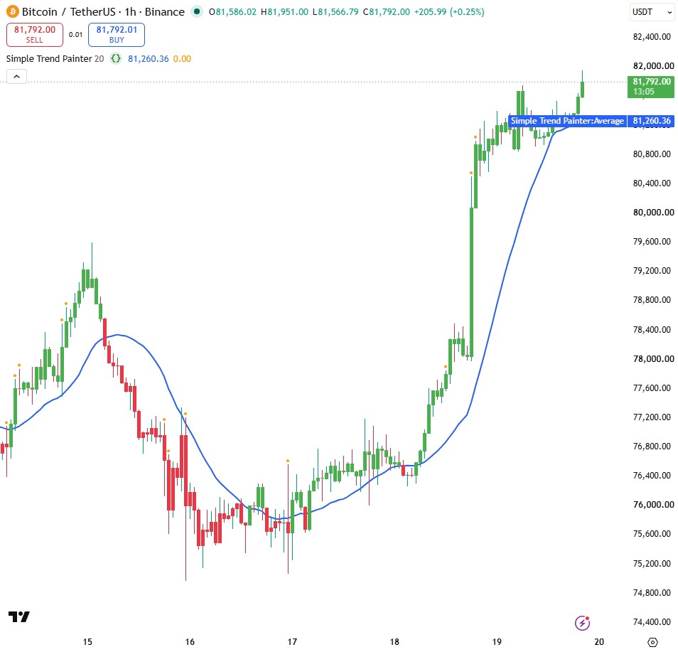

A beginner-friendly first indicator: candles painted green above a moving average and red below it, an orange dot on unusually busy candles, and an alert when price crosses the average.

- barcolor paints every candle green when the close is above the moving average and red when it is below.
- An orange circle marks candles whose volume is more than twice the 20-candle average volume.
- Create an alert on "Simple Trend Painter" and pick "Price crossed average".

## Previous Day Levels
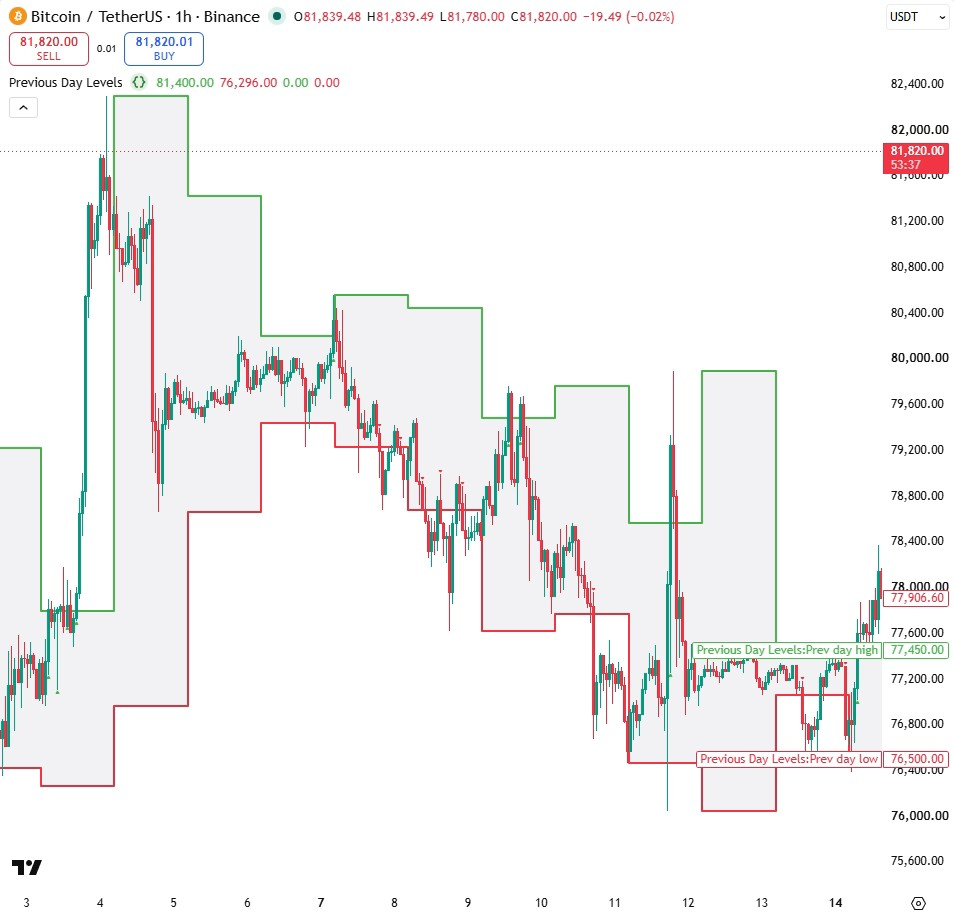

Yesterday's high and low drawn automatically on any chart and timeframe, with the range shaded, breakout markers and alerts. Non-repainting: it reads the previous completed daily candle.

- request.security reads high[1] and low[1] from the daily timeframe, so the levels are yesterday's finished values.
- lookahead is only safe here because of the [1]: the script never uses data from an unfinished day.
- Create an alert on "Previous Day Levels" and pick "Broke yesterday's high" or "Broke yesterday's low".

## Engulfing Candles
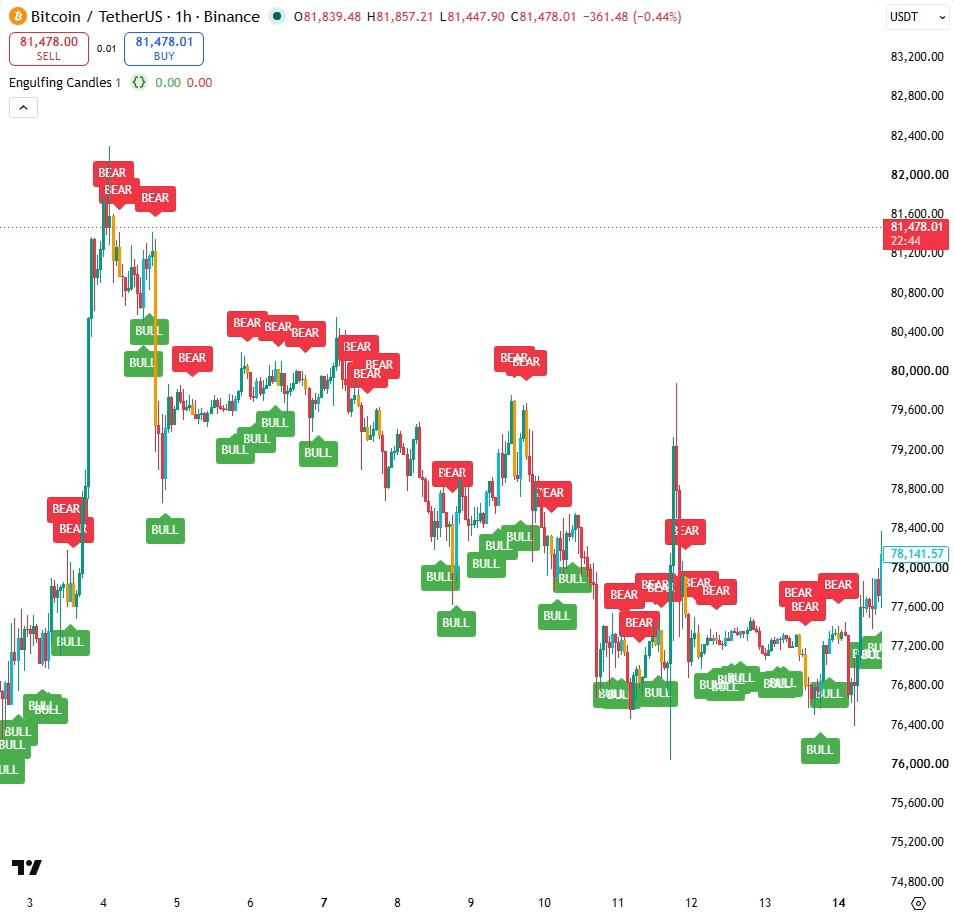

Finds bullish and bearish engulfing candles automatically, labels them BULL and BEAR, paints the candle itself, and sends alerts. A body-size ratio filters out the weak patterns.

- A bullish engulfing needs a red candle followed by a green body that covers it, and is bigger by the ratio you set.
- math.abs measures each body, so the comparison ignores the direction of the candle.
- Create an alert on "Engulfing Candles" and pick "Bullish engulfing" or "Bearish engulfing".

## My First Strategy
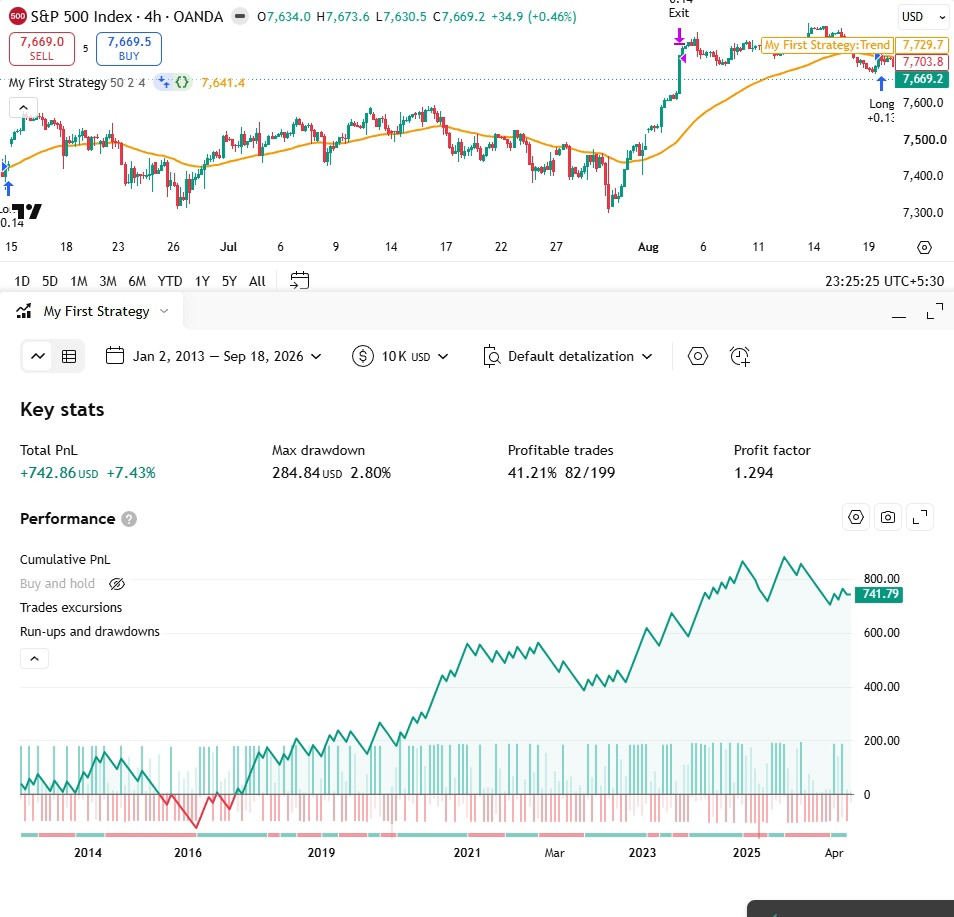

A beginner strategy for learning the Strategy Tester: buy when price closes back above a trend average, then a 2% stop loss and a 4% take profit. Commission and slippage are included, so the back test is honest.

- strategy() sets 10,000 starting capital, 10% of equity per trade, 0.05% commission and 2 ticks of slippage.
- strategy.entry buys on a close back above the trend average, but only when no position is open.
- strategy.exit places the stop and target together; whichever price is hit first closes the trade.

## Trend Dashboard
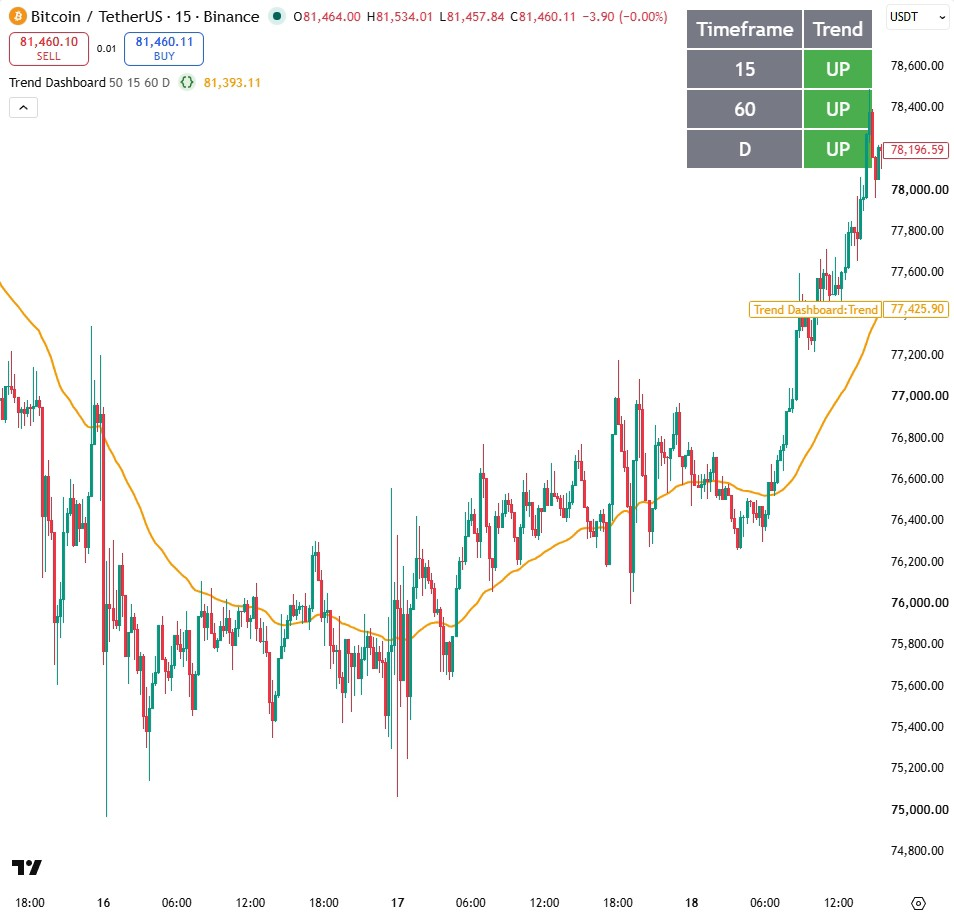

A small table in the corner of the chart showing whether price is above or below its trend average on three timeframes at once. Every timeframe is a setting, so you can match it to how you trade.

- A small trendUp() function asks one question: is the close above its EMA?
- request.security runs that same function on each of the three timeframes you choose.
- table.new with var creates the table once, and barstate.islast fills it in on the newest candle only.

## Pivot Levels
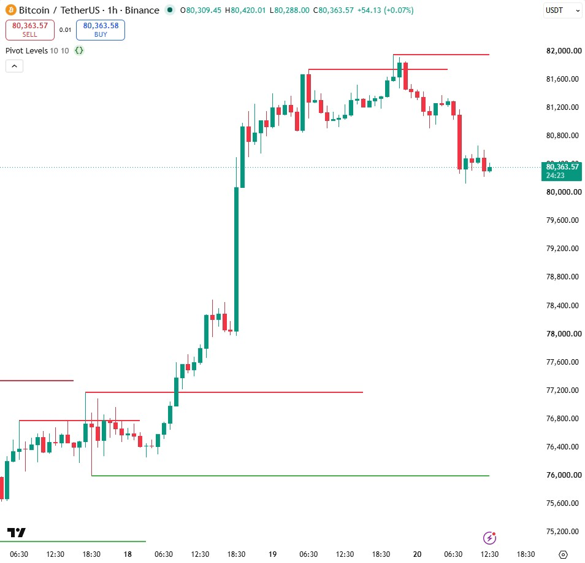

Support and resistance drawn by the code: it finds pivot highs and lows, draws each level as a line that stretches forward with price, and alerts you when the newest level breaks.

- ta.pivothigh and ta.pivotlow find a candle that is higher (or lower) than the chosen number of candles on both sides.
- A level is only confirmed after the right-hand candles exist, so it appears a few candles late. That is honest, not a bug.
- line.set_x2 stretches the newest support and resistance to the current candle on every bar.

## Session Filter
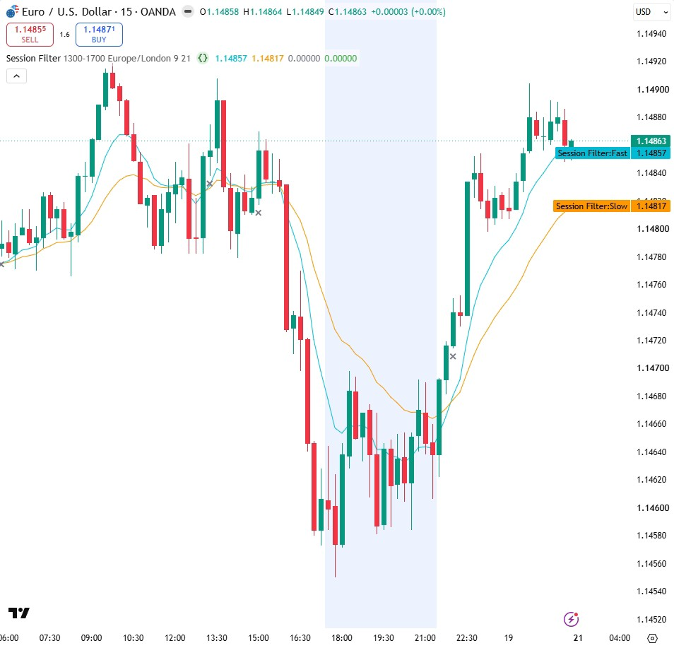

Shades your trading hours on the chart and keeps signals only inside them. Every signal the filter removed is marked with a grey cross, so you can see exactly what it cost you.

- time() returns na outside the session, so not na(time(...)) is true only inside your hours.
- bgcolor shades those hours; na means paint nothing at all.
- buySignal = rawBuy and inSession. That single "and" is the whole filter.

## Risk Managed Strategy
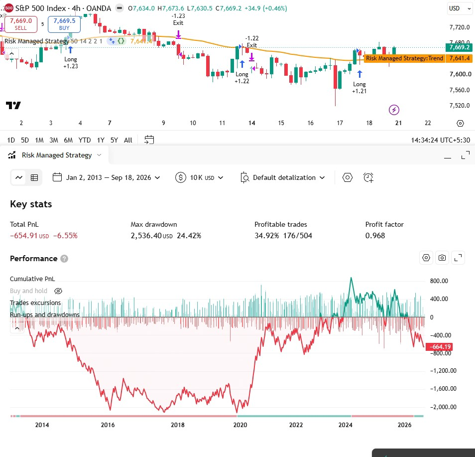

An ATR stop and a position size calculated from the risk you choose, so every loss costs the same. The back test result is honestly negative, and the lesson explains exactly why.

- stopDist = ATR x multiplier, so the stop fits how far price is actually moving today.
- qty = math.min(riskCash / stopDist, equity / close): every loss costs the same, and the size never exceeds what the account can fund.
- A tighter stop means more trades (199 in lesson 5 became 504 here), and every extra trade pays commission and slippage.

## Mini Screener
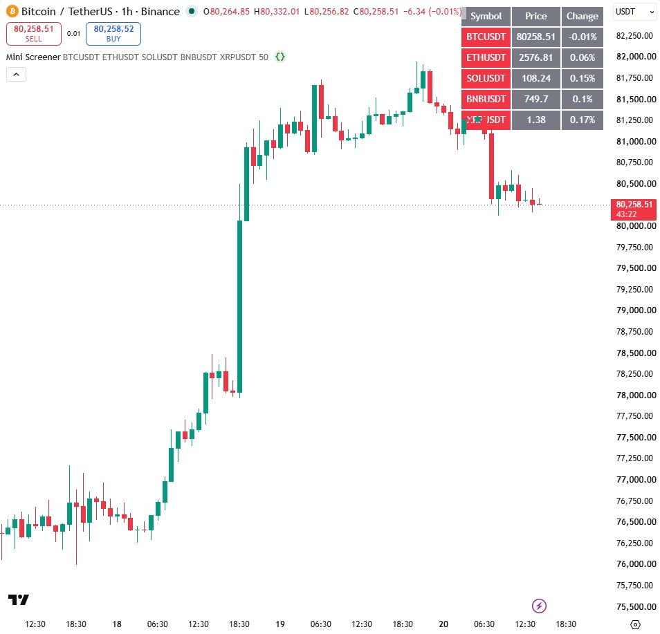

One table on one chart that watches five markets at once: price, change since the last candle, and whether each one is above its trend average. Built with arrays and a loop.

- One small function returns three answers in a bag: [close, change, above trend].
- request.security runs that function on each symbol you pick, so each call carries three values instead of one.
- array.from stores the answers and a for loop fills every row, so adding markets does not mean adding code.

## Alerts & Automation
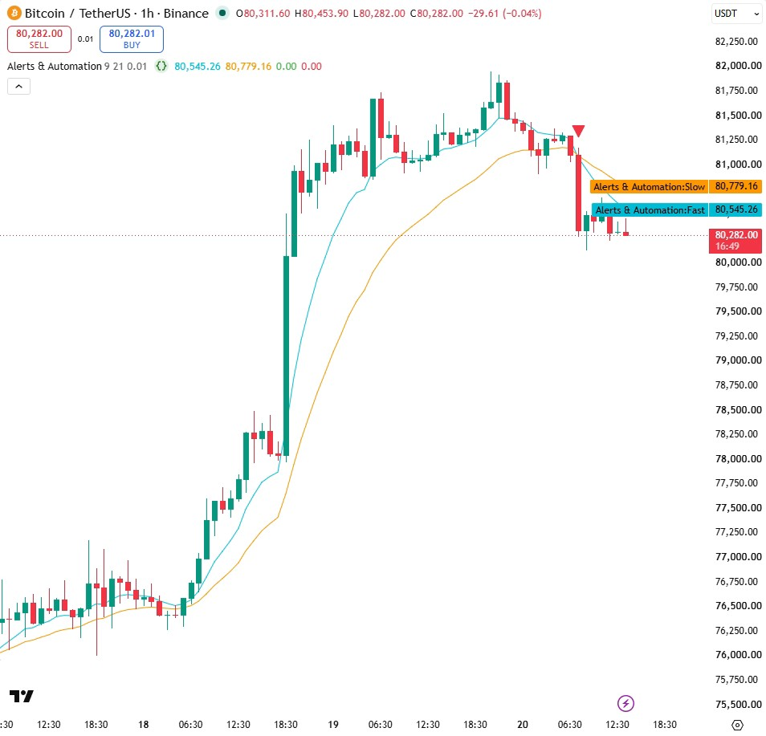

Both ways Pine Script raises an alert, side by side: a readable message for your phone, and a JSON message for a webhook, which is the first real step towards automated trading.

- alertcondition() adds an entry to the alert menu. alert() fires from inside the code and can build the message while the script runs.
- barstate.isconfirmed means the alert only fires on a finished candle, so a signal cannot vanish after it fires.
- The JSON message is plain text in a shape a program can read: send it to a webhook and your own program places the order.

## Z-Score Lab
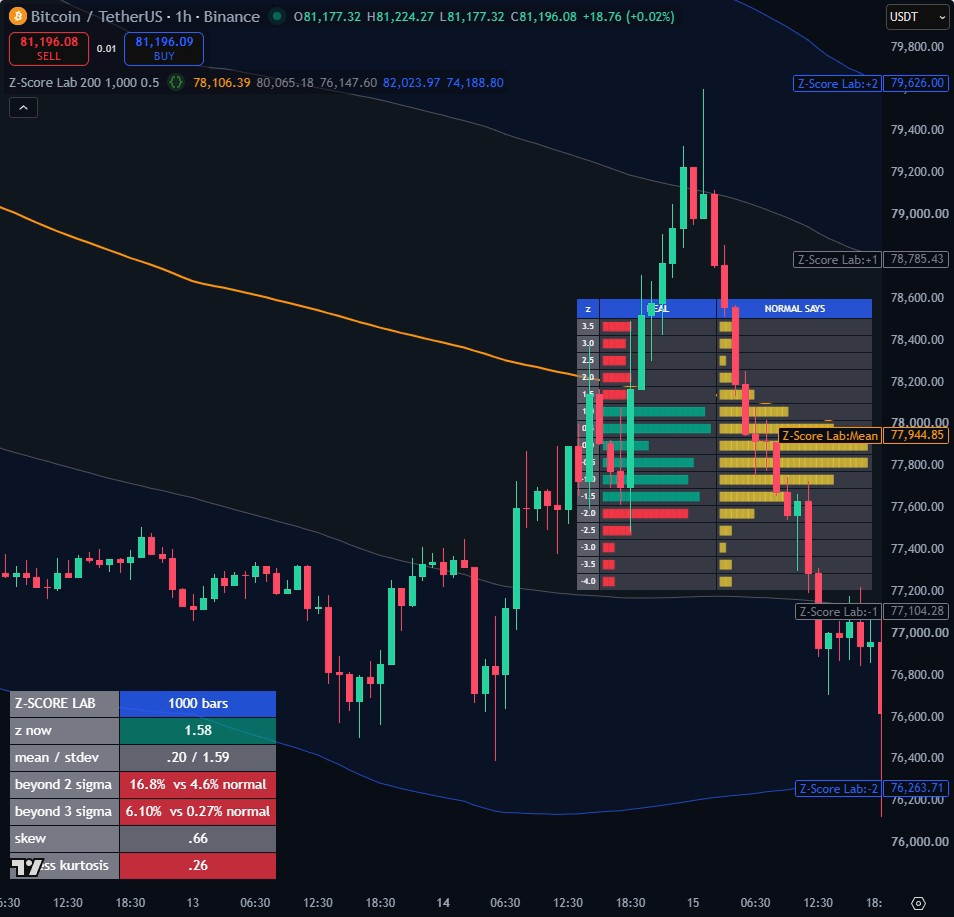

Standard deviation bands drawn on price, with a live table that counts how often price actually left them and compares that with what a normal distribution predicts. On crypto the 2-sigma band is breached about three times more often than the textbook says.

- ta.sma and ta.stdev over the lookback give the mean and the sigma; the z-score is just how many sigmas price sits from that mean.
- The histogram is a table, not a drawing: the z-scores are bucketed into fixed bins and each row is coloured by count, so it renders on any TradingView build.
- The normal comparison uses an Abramowitz-Stegun approximation of the normal CDF, so the expected percentages are computed in Pine rather than hard-coded.

## Expectancy & Kelly Lab
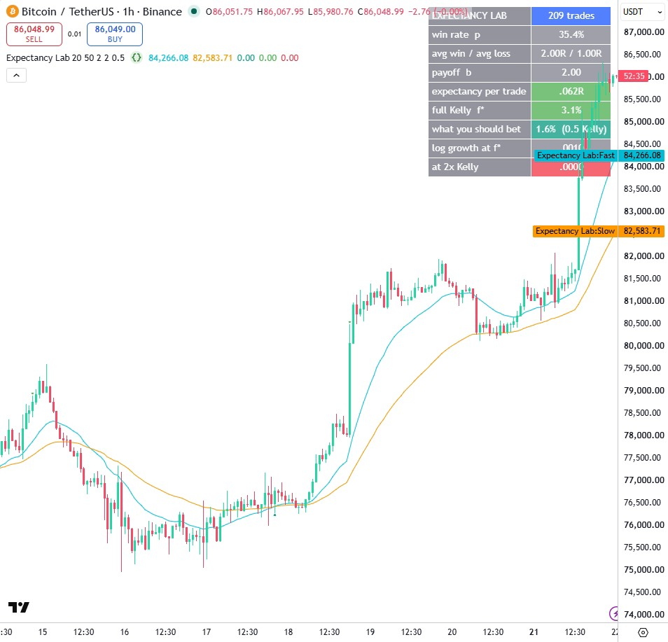

A deliberately simple moving-average signal that keeps its own trade list, then measures its expectancy in R, the full Kelly fraction implied by its own win rate and payoff, and the growth rate you would get at Kelly and at twice Kelly.

- Trades are tracked in ordinary variables: one open trade at a time, a loser is -1R and a winner is the reward multiple, by construction.
- Expectancy is the mean of that R list; the Kelly fraction follows from the win rate and the payoff ratio, both measured, never assumed.
- The table also shows the growth rate at twice Kelly, which is where a winning edge still ends in ruin.

## Monte Carlo Lab
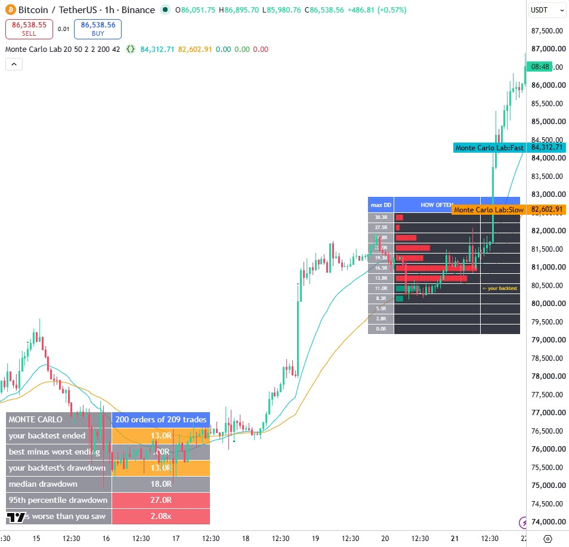

Your backtest is one ordering of your trades, not the only one it could have had. This shuffles the same closed trades into two hundred alternative histories and shows where the real backtest sits among them.

- The same R-multiple trade list is shuffled with a seeded generator, so a re-run reproduces the identical set of histories.
- Each shuffled history is walked once to record its ending and its worst drawdown, which is what the percentile rows report.
- Only the ORDER changes: the trades, the win rate and the payoff are untouched, so anything that moves is path risk, not edge.

## Martingale Lab
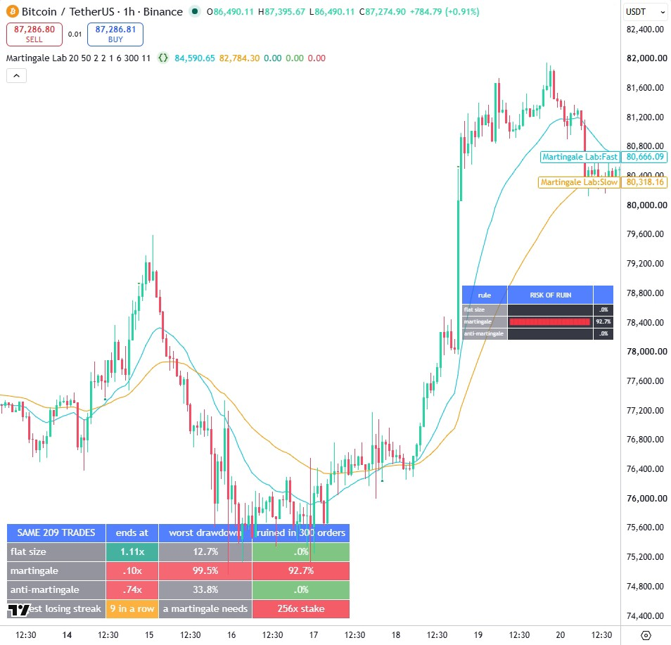

Doubling after a loss tested honestly. The same 209 trades are re-run under flat sizing, martingale and anti-martingale, across three hundred orderings, and the ruin rate is counted rather than argued about.

- Each sizing rule consumes the same list of R multiples, so the only difference between the three columns is bet size after a loss.
- A run counts as ruined when equity falls below the capital needed for the next required bet, which is what makes the ruin rate a measurement.
- The panel also prints the stake a martingale would need after the longest losing streak in the data.

## Volatility Regime Lab
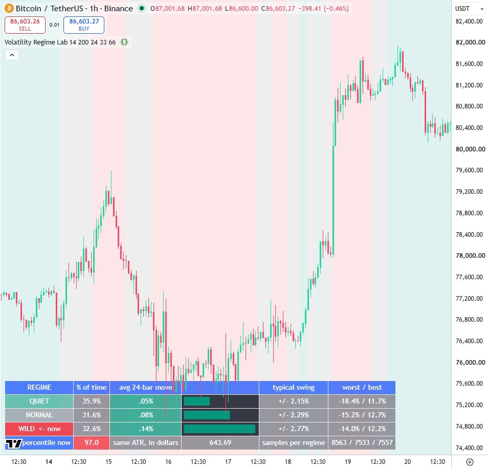

ATR in dollars tells you nothing on its own. This ranks today's ATR against its own recent history, splits the chart into quiet, normal and wild regimes, and measures the forward return that followed each one.

- ta.percentrank turns ATR into its own percentile, so the regime is relative to the instrument and the timeframe rather than to a dollar figure.
- The forward return is attributed to the regime the bar was in and measured on closed data only, so nothing repaints.
- Counts, means, best and worst are accumulated per regime in arrays, which is what the table reports.

## Supply & Demand Zones
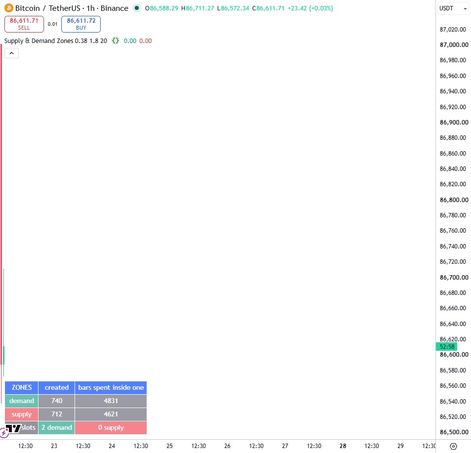

What the paid zone indicators are actually doing, written out in arithmetic: a small-bodied base candle, then an impulse candle that runs away from it, leaves a zone behind.

- A base candle is indecision stated as arithmetic: body divided by range, below a threshold you set.
- A zone is born when an impulse candle leaves a base behind, which is the 'institutional order block' idea without the mystique.
- Three slots per side are held in arrays as a ring buffer, so the script keeps state without drawing objects and works where drawings do not render.

## Correlation Matrix & Effective Bets
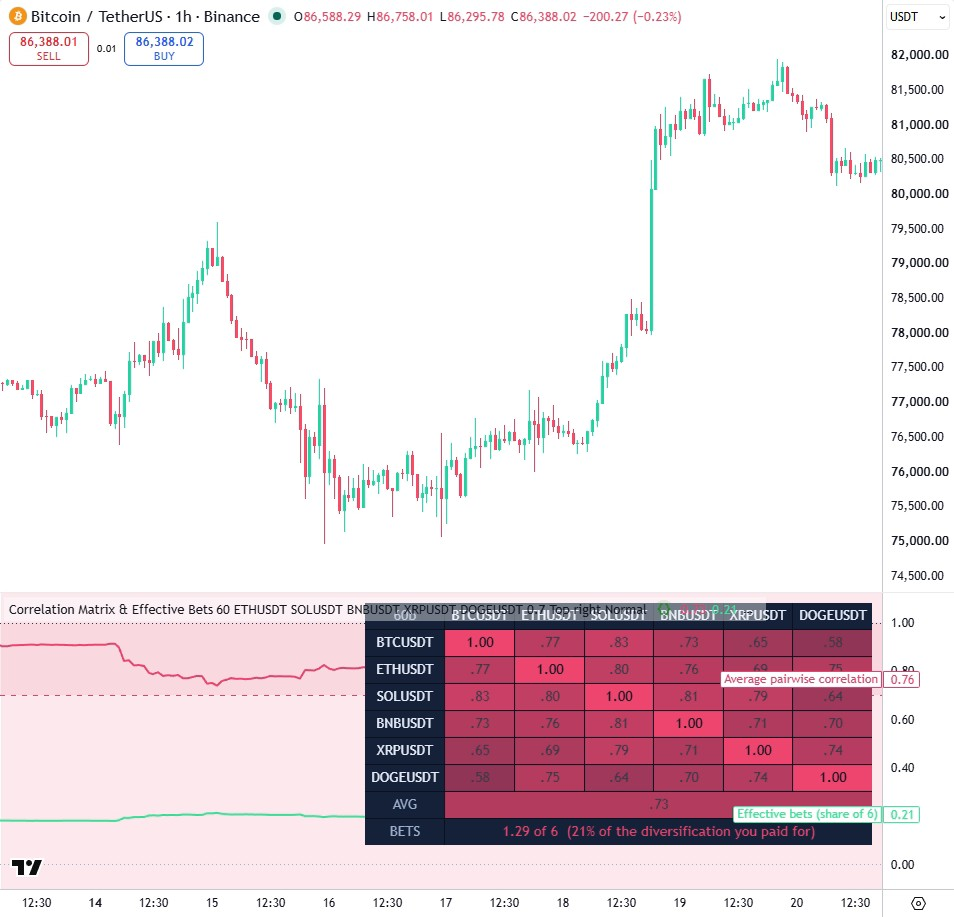

Six symbols, every pairwise correlation, and the number that matters: how many genuinely independent positions your basket actually contains.

- Each pair's correlation is measured over the same lookback on closed bars, then rendered as a coloured table cell.
- Effective bets is computed from the average correlation: it falls towards one as the basket becomes one trade wearing six tickers.
- The symbols are inputs rather than a loop, because Pine requires a constant symbol in request.security.

## Walk-Forward Lab
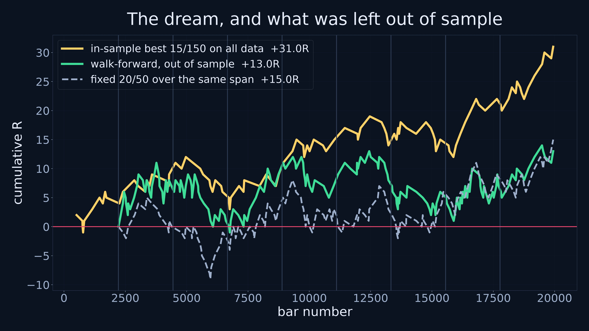

Overfitting shown rather than warned about: 154 parameter settings over 20,000 hourly candles, the in-sample best compared with an eight-fold walk-forward and with one fixed setting that was never re-optimised.

- The grid is scored on data the selection never saw, which is the only comparison that means anything.
- Eight folds re-select in-sample and then trade forward, so the equity curve is a record of decisions, not of hindsight.
- The fixed 20/50 baseline is the control: if tuning cannot beat it out of sample, the tuning was noise.

## Market Structure: BOS & CHoCH
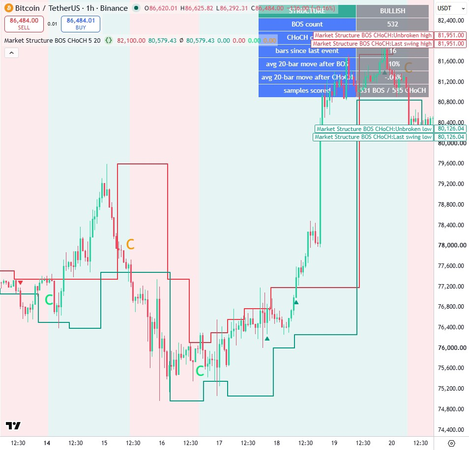

Break of structure and change of character defined precisely enough to count, then scored: what price actually did in the twenty bars after each signal.

- ta.pivothigh and ta.pivotlow only confirm a pivot after the lookahead bars have closed; that lag is real and the script does not hide it.
- State is two most-recent confirmed swings plus the levels still unbroken, updated on every bar.
- Every signal is scored on the forward move measured on closed bars, which is what turns a label into evidence.

## Complete System: Regime + Edge + Risk
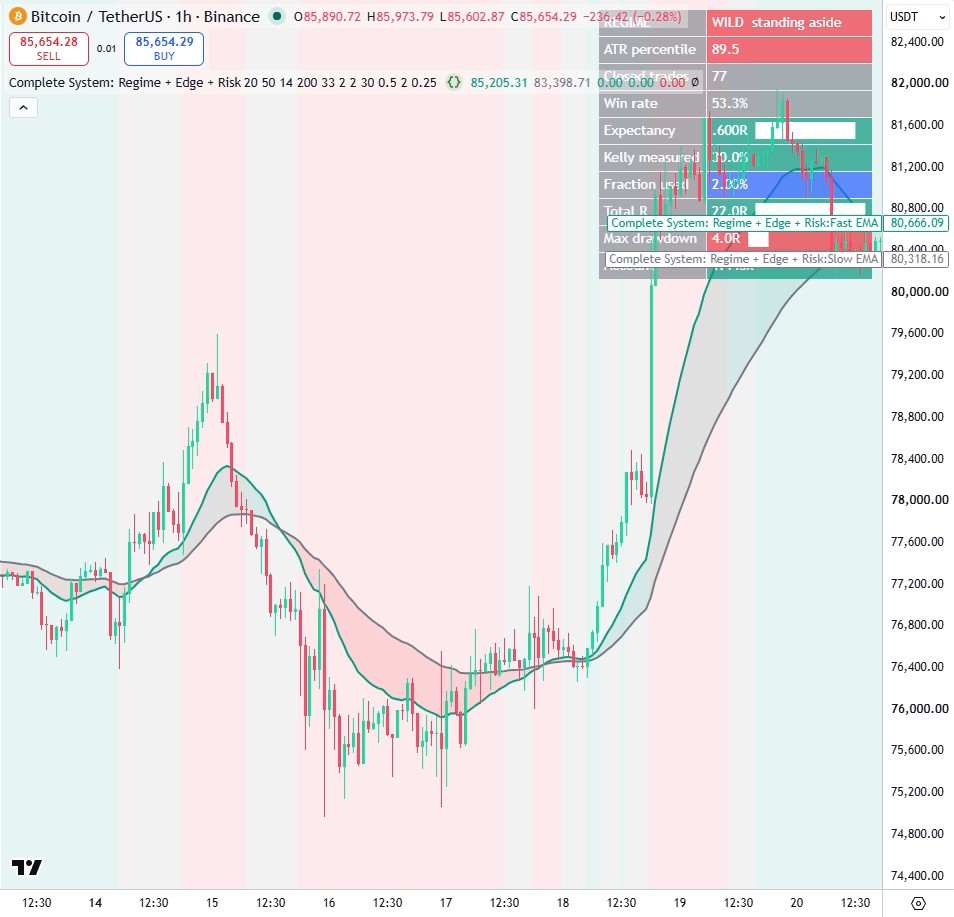

The finale of the advanced arc: a regime gate that decides IF we trade, a moving-average edge that decides WHERE, and a Kelly fraction measured from the strategy's own closed trades that decides HOW BIG.

- The regime gate ranks current ATR against its own last few hundred readings and trades only in the quiet band.
- Kelly is measured from a rolling window of the strategy's own closed trades, then halved and capped, so sizing follows evidence rather than conviction.
- The backtest is run by hand in Pine and shown on the chart, so every number in the dashboard is traceable to a trade you can point at.

## Paste Check (EMA Cross Starter)
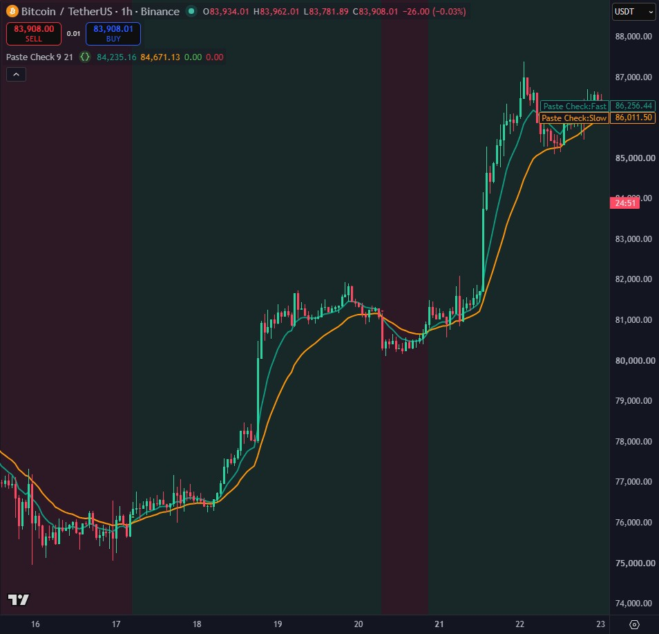

The clean script from the beginner guide on adding any Pine Script to TradingView: paste it with Ctrl+A then Ctrl+V over a new indicator, press Add to chart, and it should compile with no red and no yellow. If it does not, the video walks through the 15 paste problems that break it.

- Two EMAs (9 and 21 by default) are plotted, and ta.crossover / ta.crossunder mark where they cross.
- A var trend variable remembers the direction of the last cross, and bgcolor shades the chart green or red from it.
- It is deliberately small and uses an if block, strings and several function calls, so every common paste error shows up in it.

## How to use
1. In TradingView open the **Pine Editor**, create a new indicator (or strategy for strategy files).
2. Paste the contents of the `.pine.txt` file and click **Add to chart**.

## Custom work
Need a custom Pine Script indicator/strategy, an MQL5 EA, or a TradingView-to-broker bridge? → https://jayadevrana.in/

## License
[Mozilla Public License 2.0](LICENSE) (the TradingView open-source default). Educational content only — **not financial advice**. Past performance does not predict future results.

---
Keywords: pine script v6, pine script course, pine script tutorial, tradingview indicator, free tradingview indicators, pine script strategy, non repainting indicator, tradingview alerts, backtesting, algo trading
