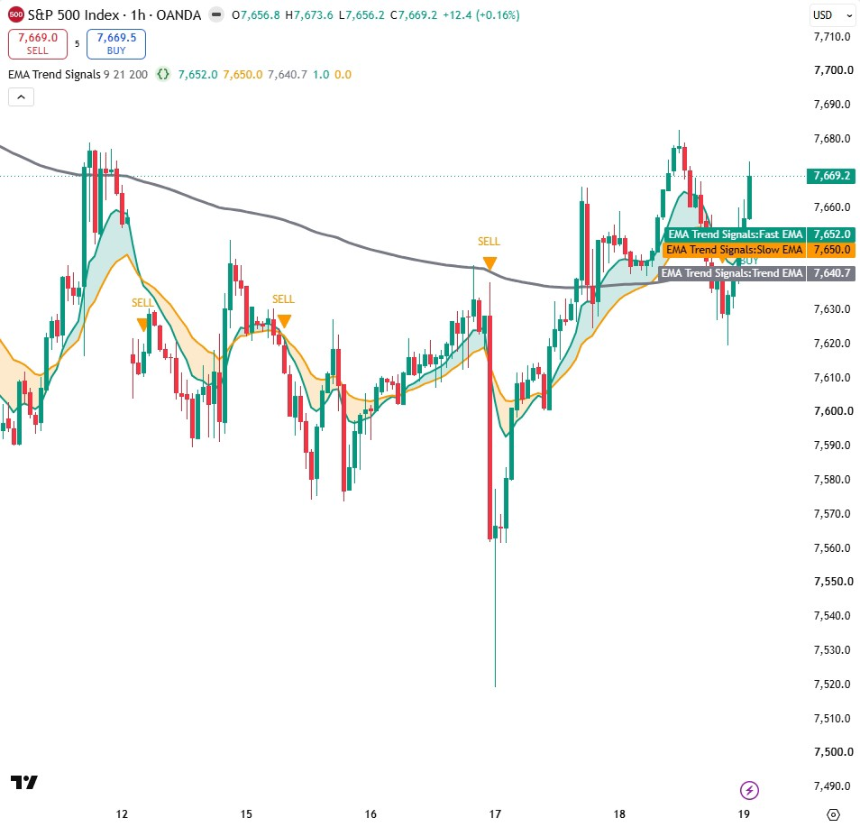
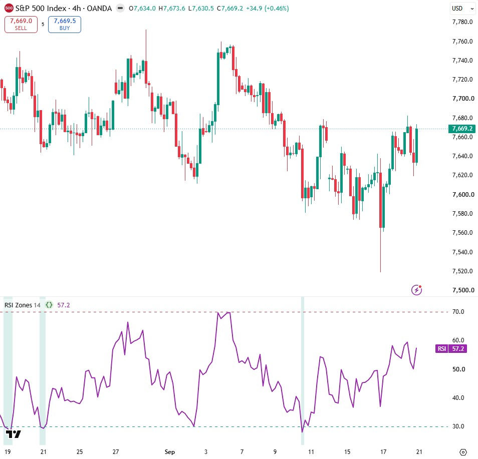
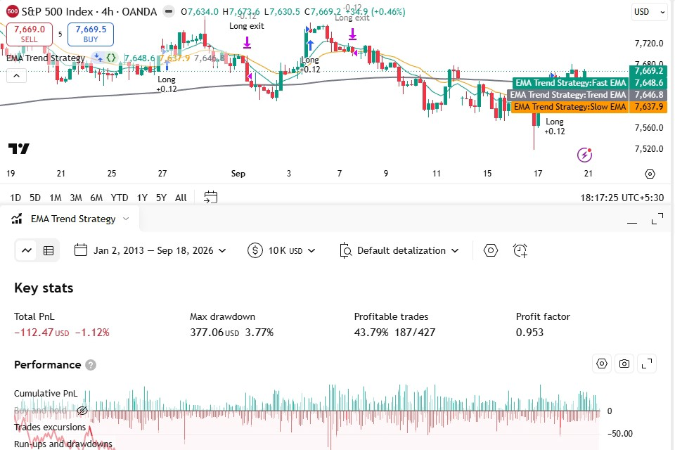

# Free Pine Script Indicators & Strategies (TradingView, Pine Script v6)

Free, open-source **TradingView Pine Script v6** indicators and strategies from my YouTube lessons, with chart snapshots and **honest backtests (costs included)**.
Every script compiles cleanly in Pine Script v6 and the signal logic is non-repainting.

**Copy-paste pages with snapshots:** https://jayadevrana.in/free-pine-script-indicators/
**YouTube:** [@jayadevranaalgo](https://www.youtube.com/@jayadevranaalgo)

| Script | Type | What it does | Code | Video |
|---|---|---|---|---|
| **EMA Trend Signals** | Indicator (overlay) | 9/21 EMA crossover filtered by a 200 EMA trend, trend fill, non-repainting BUY/SELL labels, alert conditions | [scripts/ema-trend-signals.pine.txt](scripts/ema-trend-signals.pine.txt) · [page](https://jayadevrana.in/free-pine-script-indicators/ema-trend-signals/) | [▶ Channel](https://www.youtube.com/@jayadevranaalgo) |
| **RSI Zones** | Indicator (pane) | RSI with 70/30 levels and overbought/oversold background shading | [scripts/rsi-zones.pine.txt](scripts/rsi-zones.pine.txt) · [page](https://jayadevrana.in/free-pine-script-indicators/rsi-zones/) | [▶ Watch](https://youtu.be/hWeaFBH0lbk) |
| **EMA Trend Strategy** | Strategy | EMA trend entries, 2 ATR stop / 3 ATR target, 0.05% commission + 2 ticks slippage, JSON `alert_message` for webhook automation | [scripts/ema-trend-strategy.pine.txt](scripts/ema-trend-strategy.pine.txt) · [page](https://jayadevrana.in/free-pine-script-indicators/ema-trend-strategy/) | [▶ Watch](https://youtu.be/hWeaFBH0lbk) |

## EMA Trend Signals

BUY needs a fast-over-slow EMA cross **while price is above the 200 EMA**; SELL is the mirror image. Signals are gated with `barstate.isconfirmed`, so they only print after the candle closes and never disappear.

## RSI Zones

`overlay = false` draws the RSI in its own pane; `bgcolor()` with a nested ternary shades the zones.

## EMA Trend Strategy + an honest backtest

OANDA:SPX500USD, 4h, Jan 2013 to Sep 2026, $10,000 start, 10% of equity per trade, 0.05% commission per order, 2 ticks slippage:

| Trades | Win rate | Profit factor | Total P&L | Max drawdown |
|---|---|---|---|---|
| 427 | 43.8% | 0.95 | **-$112 (-1.1%)** | $377 (3.8%) |

About +$298 before costs; roughly $411 of commission turned it into a loss. It's published as a teaching example of why costs must be in every backtest, **not** as a trading system.

### Webhook automation
Each entry carries a JSON message (`{"side":"buy","symbol":"{{ticker}}"}`). Put `{{strategy.order.alert_message}}` in a strategy alert's message and enable **Webhook URL** (paid TradingView plan + 2FA required) to forward fills to your own bridge server. Paper-trade first.

## How to use
1. In TradingView open the **Pine Editor**, create a new indicator (or strategy for the strategy file).
2. Paste the contents of the `.pine.txt` file and click **Add to chart**.

## Custom work
Need a custom Pine Script indicator/strategy, an MQL5 EA, or a TradingView-to-broker bridge? → https://jayadevrana.in/

## License
[Mozilla Public License 2.0](LICENSE) (the TradingView open-source default). Educational content only — **not financial advice**. Past performance does not predict future results.

---
Keywords: pine script v6, tradingview indicator, free tradingview indicators, pine script strategy, ema crossover, rsi indicator, non repainting indicator, tradingview strategy tester, backtesting, tradingview webhook alerts, algo trading
